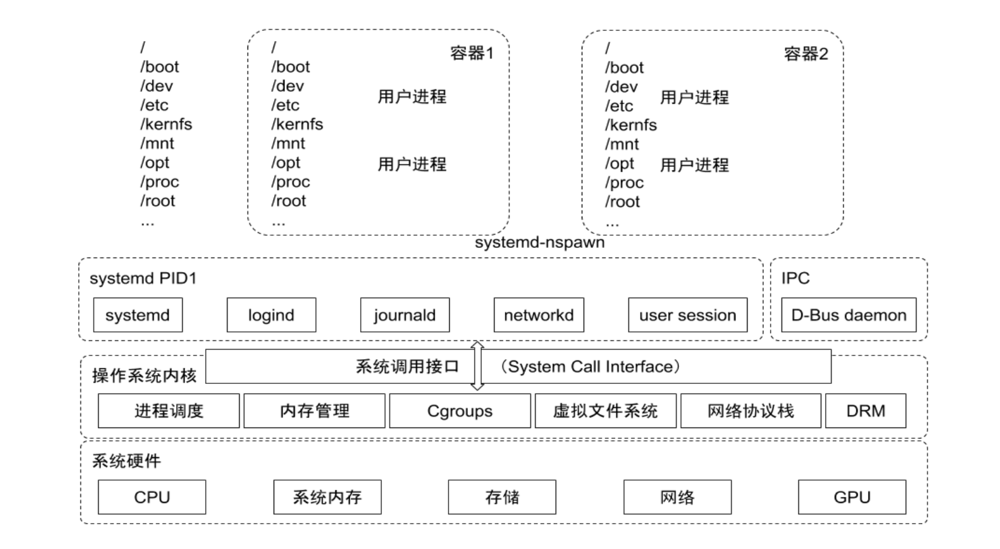

## Linux Cgroup

[TOC]

- cgroup - 关联一组task和一组subsystem的配置参数。一个task对应一个进程, cgroup是资源分片的最小单位。
- subsystem - 资源管理器，一个subsystem对应一项资源的管理，如 cpu, cpuset, memory等
- hierarchy - 关联一个到多个subsystem和一组树形结构的cgroup. 和cgroup不同，hierarchy包含的是可管理的subsystem而非具体参数

cgroup 对资源的管理是一个树形结构，类似进程，cgroups 在不同的系统资源管理子系统中以层级树（hierachy）的方式来组织管理，每个 cgroup 都可以包含子 cgroup，因此子 cgroup 的资源除了受本 cgroup 影响外还受父 cgroup 影响

子进程 cgroup 继承父进程 cgroup



#### 进程数据结构

```c
struct task_struct {
  ...
  # ifdef CONFIG_CGROUPS
  struct css_set__rcu *cgroups;
  struct list_head cg_list;
  #endif
  ...
}
```

#### namespace 数据结构

```c
struct css_set {
  struct cgroup_subsys_state *subsys[CGROUP_SUBSYS_COUNT];
}
```

### hierachy 

```
/cgroup/
├── blkio                           <--------------- hierarchy/root cgroup                   
│   ├── blkio.io_merged             <--------------- subsystem parameter
... ...
│   ├── blkio.weight
│   ├── blkio.weight_device
│   ├── cgroup.event_control
│   ├── cgroup.procs
│   ├── lxc                         <--------------- cgroup
│   │   ├── blkio.io_merged         <--------------- subsystem parameter
│   │   ├── blkio.io_queued
... ... ...
│   │   └── tasks                   <--------------- task list
│   ├── notify_on_release
│   ├── release_agent
│   └── tasks
...
```

### subsystem

```shell
 ls /sys/fs/cgroup/ -l
total 0
drwxr-xr-x 2 root root  0 May 31 10:34 blkio
lrwxrwxrwx 1 root root 11 May 31 10:34 cpu -> cpu,cpuacct
lrwxrwxrwx 1 root root 11 May 31 10:34 cpuacct -> cpu,cpuacct
drwxr-xr-x 4 root root  0 May 31 10:34 cpu,cpuacct
drwxr-xr-x 2 root root  0 May 31 10:34 cpuset
drwxr-xr-x 4 root root  0 May 31 10:34 devices
drwxr-xr-x 2 root root  0 May 31 10:34 freezer
drwxr-xr-x 2 root root  0 May 31 10:34 hugetlb
drwxr-xr-x 4 root root  0 May 31 10:34 memory
lrwxrwxrwx 1 root root 16 May 31 10:34 net_cls -> net_cls,net_prio
drwxr-xr-x 2 root root  0 May 31 10:34 net_cls,net_prio
lrwxrwxrwx 1 root root 16 May 31 10:34 net_prio -> net_cls,net_prio
drwxr-xr-x 2 root root  0 May 31 10:34 perf_event
drwxr-xr-x 2 root root  0 May 31 10:34 pids
drwxr-xr-x 4 root root  0 May 31 10:34 systemd
```

cgroups 实现了对资源的配额和度量

- blkio：设置限制每个块设备的输入输出控制。例如:磁盘，光盘以及usb等等。
- cpu：使用调度程序为cgroup任务提供cpu的访问。
- cpuacct：产生cgroup任务的cpu资源报告。
- cpuset：如果是多核心的cpu，这个子系统会为cgroup任务分配单独的cpu和内存。
- devices：允许或拒绝cgroup任务对设备的访问。
- freezer：暂停和恢复cgroup任务。
- memory：设置每个cgroup的内存限制以及产生内存资源报告。
- net_cls：标记每个网络包以供cgroup方便使用。
- ns：名称空间子系统。
- pids：进程标识子系统
- perf_event：增加了对每group的监测跟踪的能力，即可以监测属于某个特定的group的所有线程以及行在特定CPU上的线程，此功能对于监测整个group非常有用

##### cpu 子系统

